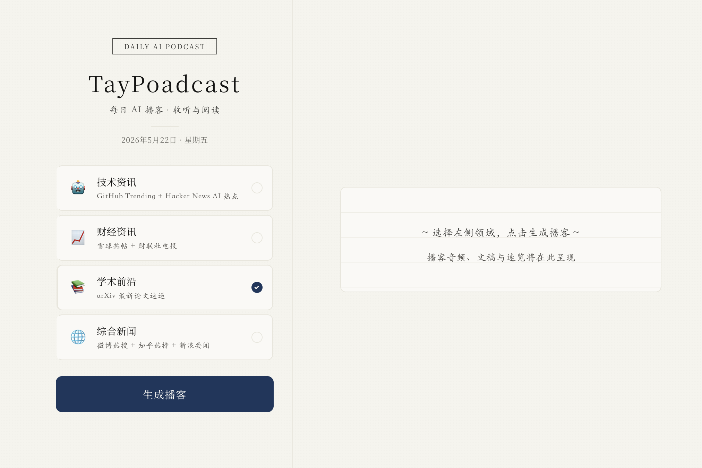
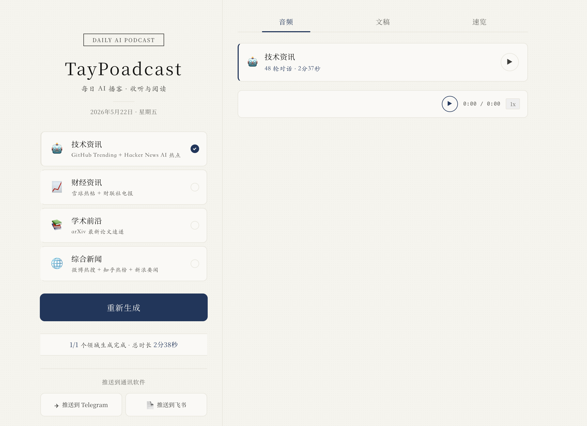
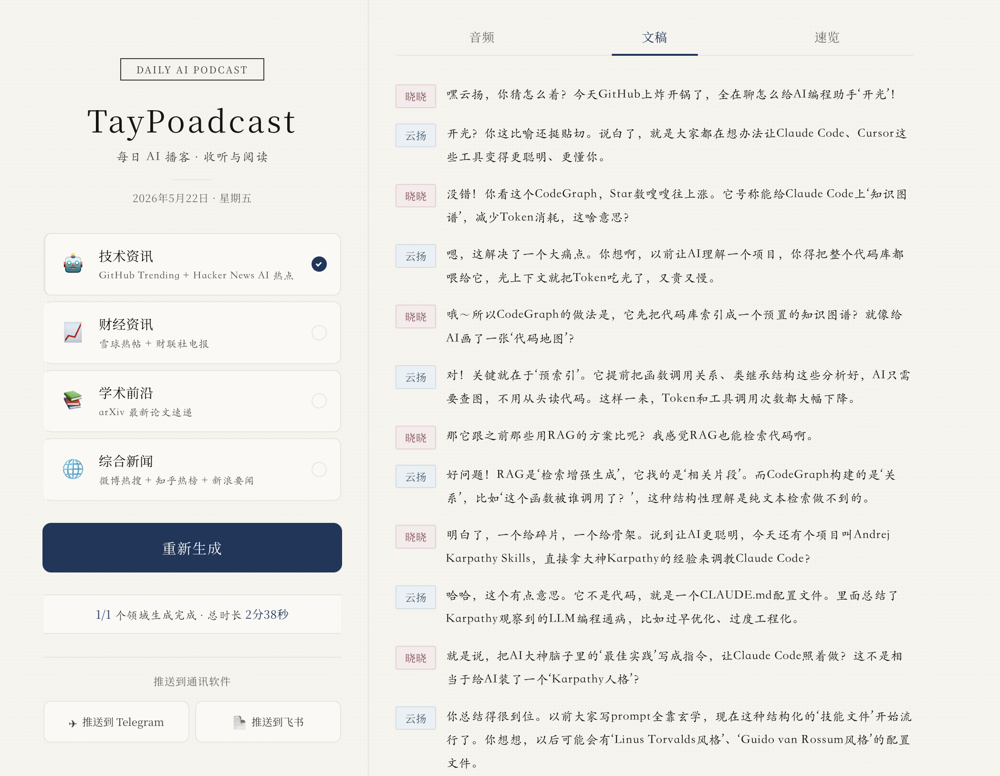
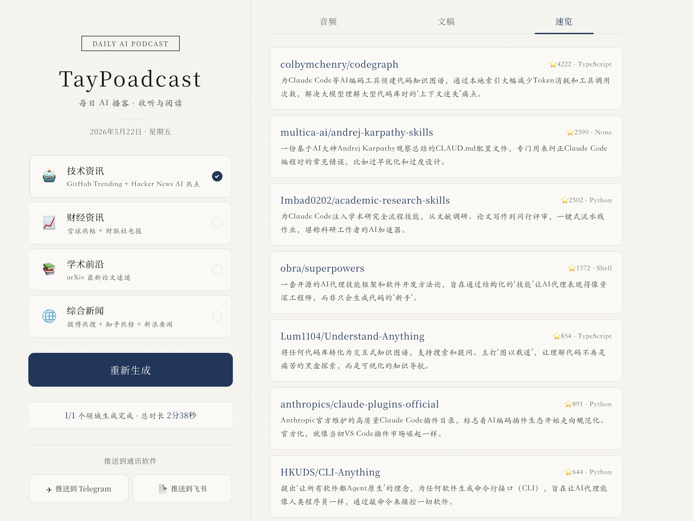

# TayPoadcast

> 每天早上 10 点，AI 双人播客为你解读 GitHub 热门仓库和 AI 圈动态。

TayPoadcast 是一个全自动的 AI 新闻播客生成器。它每天自动采集多领域热点，用 LLM 生成 NotebookLM 风格的双人中文对谈脚本，通过 Edge TTS 合成 MP3，推送到 Telegram / 微信 / 飞书，并提供一套**日式手帳日志风格**的 Web 控制面板，让你在浏览器中一站式完成播客生成、试听、预览和推送。

**无需服务器，零成本运行** — 管线跑在 GitHub Actions 免费额度上，Web UI 可本地启动。

---

## Web 控制面板

基于 Flask + 原生 HTML/CSS 的播客控制中心，采用 **kami（紙）设计系统**——暖色羊皮纸底色、墨蓝 accent、中文衬线字体排版，左右双栏布局：

```
┌─ 左栏（340px）────────────┐  ┌─ 右栏（flex:1）─────────────────────┐
│  TayPoadcast              │  │  ┌ 音频 │ 文稿 │ 速览 ┐               │
│  2026年5月22日 · 星期四    │  │  │ 🔊 AI 播客 · 12轮对话            │
│                           │  │  │ ▶ 播放按钮 · 时长                │
│  🖥️ AI与技术              │  │  └─────────────────────────┘         │
│  GitHub Trending          │  │                                     │
│                           │  │  对话文稿 · 晓晓/云扬 双人标注        │
│  💰 财经                  │  │                                     │
│  雪球 + 财联社             │  │  仓库速览 · star/语言/摘要           │
│                           │  │                                     │
│  [    生成播客    ]       │  │  ───────────────────────────        │
│                           │  │  ▶ 0:00 / 10:24    1x              │
│  ── 推送到通讯软件 ──      │  └─────────────────────────────────────┘
│  [Telegram] [微信] [飞书]  │
└───────────────────────────┘
```

**特性：**
- **双栏布局** — 左侧领域选择 + 生成控制，右侧展示音频/文稿/速览
- **kami 设计系统** — 来自 Open Design 的羊皮纸美学，墨蓝单色 accent，无粗体无斜体
- **迷你播放器** — 固定在右栏底部，支持播放/暂停、倍速切换、波形动画
- **在线试听** — 生成后直接在浏览器播放 MP3，无需下载
- **多通道推送** — Telegram / 微信 / 飞书，飞书支持 Web UI 内填写凭证

### 界面预览

**空白态 — 横格纸引导页**



**音频 Tab — 结果卡片 + 迷你播放条**



**文稿 Tab — 晓晓/云扬双人对话**



**速览 Tab — 仓库摘要卡片**



```bash
# 启动 Web UI
python web_app.py
# → http://localhost:5001
```

---

## 效果预览

**Telegram — 直接收听 MP3**

```
🎙️ AI新闻播客 | 2026年05月20日

📦 本期 GitHub 仓库：
  1. tinyhumansai/openhuman — ⭐3991 | Rust
     本地运行私人AI助手，数据自控、极简强大
  2. colbymchenry/codegraph — ⭐1869 | TypeScript
     Claude Code/Cursor专用代码知识图谱，减少token消耗

📻 共 22 轮对话 · 时长 4分44秒
点击下方音频收听 ↓
```

**微信 — 文字简报**

```
AI新闻早报 | 5月20日

1.openhuman ⭐3991 本地运行私人AI助手，数据自控
2.codegraph ⭐1869 Claude Code专用代码知识图谱
3.superpowers ⭐1620 Agent技能框架，标准化协作
```

---

## 核心特性

- **NotebookLM 风格双人播客** — 晓晓（好奇提问）+ 云扬（深度解读），有互动、有停顿、有金句
- **全中文输出** — 仓库简介、对话脚本、推送文案全部中文化
- **多 LLM 支持** — DeepSeek / Claude / OpenAI 自动检测，推荐 DeepSeek（~¥0.003/天）
- **三通道推送** — Telegram 发 MP3，微信发文字简报，飞书支持 Web UI 配置
- **GitHub Pages 托管** — 播客自动部署到公网，支持在线播放
- **完全自动化** — GitHub Actions 定时触发，每天 10 点（北京时间）准时推送
- **多领域模块化** — 技术/财经/学术/综合新闻，按需启用，每个领域独立生成播客
- **Web 控制面板** — 手帳日志风 UI，kami 设计系统，左右双栏，一站式操作

---

## 快速开始

### 1. Fork 仓库

```bash
git clone https://github.com/pipiwolve/TayPoadcast.git
cd TayPoadcast
```

### 2. 配置 Secrets

在 GitHub 仓库 → Settings → Secrets and variables → Actions，添加：

| Secret | 说明 | 必需 |
|--------|------|------|
| `DEEPSEEK_API_KEY` | DeepSeek API Key（推荐） | 三选一 |
| `ANTHROPIC_API_KEY` | Claude API Key | 三选一 |
| `TELEGRAM_BOT_TOKEN` | Telegram Bot Token | 推送用 |
| `TELEGRAM_CHAT_ID` | Telegram Chat ID | 推送用 |

### 3. 手动触发测试

Actions → Daily AI News Podcast → Run workflow

---

## 架构

```
GitHub Actions (cron: 每天 10:00 北京时间)
  │
  ├─ fetcher.py         → GitHub Trending + Hacker News
  ├─ script_generator.py → LLM 生成双人中文对话 + 仓库速览
  ├─ audio_generator.py → Edge TTS 合成双声部 MP3
  ├─ notifier.py        → Telegram (MP3) + 微信 (简报)
  └─ GitHub Pages       → 公网托管 MP3
```

### 技术栈

| 层级 | 技术 |
|------|------|
| 脚本生成 | DeepSeek / Claude / OpenAI API |
| 语音合成 | Microsoft Edge TTS（免费，中文原生） |
| 音频处理 | ffmpeg |
| 任务调度 | GitHub Actions |
| 消息推送 | Telegram Bot API / 微信测试号 / 飞书 Bot |
| 文件托管 | GitHub Pages |
| Web UI | Flask + 原生 HTML/CSS（kami 设计系统） |

---

## 项目结构

```
.
├── main.py                 # 入口：4 种运行模式
├── web_app.py              # Web 控制面板（Flask + kami 手帳日志风 UI）
├── fetcher/                  # 多领域信息源模块（热插拔架构）
│   ├── base.py               # BaseFetcher 基类 + 数据结构
│   ├── tech.py               # 技术模块（GitHub Trending + HN）
│   ├── finance.py            # 财经模块（雪球 + 财联社）
│   ├── academic.py           # 学术模块（arXiv 论文）
│   └── general.py            # 综合新闻模块（微博 + 知乎 + 新浪）
├── config.yaml               # 领域配置（启用/停用/自定义 prompt）
├── cli_menu.py               # 交互式配置菜单
├── script_generator.py     # LLM 脚本生成（多 Provider）
├── audio_generator.py      # Edge TTS 双人语音合成
├── notifier.py             # Telegram + 微信 + 飞书推送
├── demo_script.json        # 演示脚本（无需 API Key）
├── requirements.txt
├── .github/workflows/
│   └── daily_podcast.yml   # CI/CD 定时管线
└── SETUP.md                # 详细配置指南
```

---

## 使用方式

```bash
pip install -r requirements.txt

# 演示模式（无需任何 API Key，立即可听）
python main.py --demo

# 全自动：采集 → 脚本 → 音频 → 推送
export DEEPSEEK_API_KEY=sk-...
export TELEGRAM_BOT_TOKEN=123:abc
export TELEGRAM_CHAT_ID=123456
python main.py --auto

# 只生成脚本查看内容
python main.py --script-only
```

### 多领域配置

```bash
# 交互式菜单 — 选择领域、自定义 prompt
python cli_menu.py

# 或直接编辑 config.yaml
# 将 finance.enabled 改为 true 即可启用财经播客
```

---

## 自定义

### 修改推送时间

编辑 `.github/workflows/daily_podcast.yml`：

```yaml
schedule:
  - cron: '0 2 * * *'   # UTC 2:00 = 北京时间 10:00
  - cron: '0 0 * * *'   # 北京时间 8:00
  - cron: '0 13 * * *'  # 北京时间 21:00
```

### 更换 LLM

```bash
export LLM_PROVIDER=deepseek   # 或 anthropic / openai
export LLM_MODEL=deepseek-chat # 覆盖默认模型
```

### 添加微信推送

详见 [SETUP.md](SETUP.md) 微信配置章节。

---

## 常见问题

**Q: 每天成本多少？**
A: DeepSeek API ~¥0.003/天，GitHub Actions 免费，Edge TTS 免费。月均 < ¥0.1。

**Q: 可以不用 Telegram 只用微信吗？**
A: 微信不支持直接推送音频文件，只能发文字简报。如需收听需配合 Telegram 或直接访问 GitHub Pages 在线播放。

**Q: 播客时长可以调整吗？**
A: 编辑 `script_generator.py` 中 SYSTEM_PROMPT 的轮次和字数要求。

---

## License

MIT
